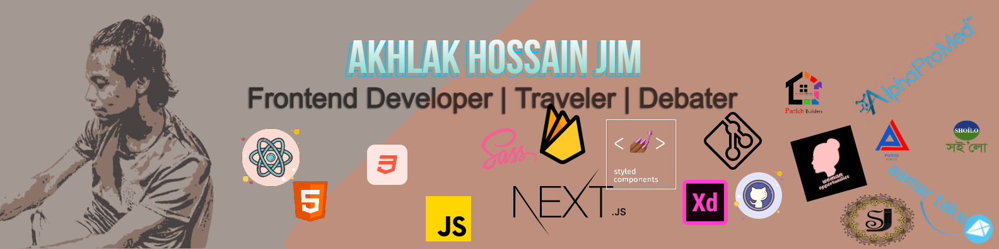

Hi there ✋!

I'm a self-thought Front-end Developer and UX designer(Learning). I'm passionate about discovering new things, Human interaction, and psychology, and highly curious, and focused on learning all parts of life. In my personal life, I look at things and try to analyze them to solve or to think, how that could be different in a positive way and what I can learn from it. I've worked on different kinds of projects, small to large challenging projects to embrace my skills. No matter what I do, I am very invested. And in every moment, I'm growing.

>The world is constantly evolving and introducing lots of things than ever before. That's why only technology is not enough; It's how a piece of tech or software technology makes you feel. And It all starts by connecting with you.

-[Akhlak Hossain Jim](https://ah-jim-seed.web.app/)

## Contact

I would love to show you my online presence [Here](http://akhlak-hossain-jim.github.io/).
You will find my all contact information there, and my inbox is always open. Whether you have a question or just want to say hello, I'll try my best to get back to you soon!

## See My Projects 

See my leatest Projects [Here](https://ah-jim-seed.web.app/).

 

## Looking for help with your code?
Find me [Here](http://akhlak-hossain-jim.github.io/).

## Resume

See my resume [Here](https://ah-jim-seed.web.app/pdf/resume.pdf)
or Visit my [LinkedIn](https://www.linkedin.com/in/akhlakhossainjim/) instade.

## Hobbies
