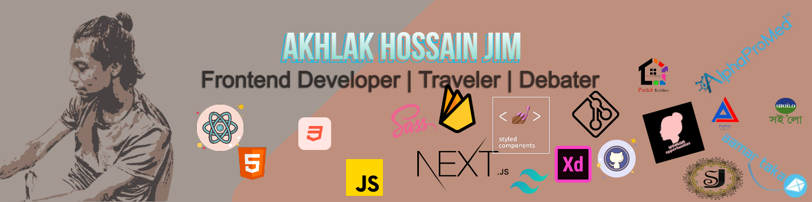

**👋 Hi there!**

I'm Akhlak Hossain Jim, a self-taught Frontend Developer with over 5 years of experience in creating and maintaining responsive, interactive web applications using cutting-edge web technologies. I possess a track record of delivering high-quality products on time and within budget, both as an independent contributor and as part of a collaborative team. My strengths lie in problem-solving, critical thinking, and analytical reasoning, and I'm known for my adaptability and commitment to continuous learning.

🚀 My passion revolves around crafting user-friendly and visually captivating web experiences. My expertise spans various tools and technologies, including React, Next.js, JavaScript, Typescript, CSS, Bootstrap, Tailwind, Styled-components, MUI, Git, GitHub, Netlify, Vercel, Firebase, Figma, and more. [Learn more about me here.](https://akhlak.dev/about/)

> "The world is constantly evolving and introducing more innovations than ever before. That's why it's not just about technology; it's about how a piece of tech or software makes you feel. And it all starts by connecting with you." - [Akhlak Hossain Jim](https://akhlak.dev/)

## 📬 How to Reach Me

- **LinkedIn**: [Connect with me on LinkedIn](https://www.linkedin.com/in/akhlakhossainjim/)
- **GitHub**: [Explore my GitHub repositories](https://github.com/Akhlak-Hossain-Jim)
- **Website**: [Visit my website, Akhlak.dev](https://akhlak.dev/)
- **Resume**: [View my resume](./resume/resume.pdf)

## 🔍 See My Projects

You can check out my latest projects [here](https://akhlak.dev/).

  
  

## 🚀 Looking for Code Help?

Feel free to reach out to me on [LinkedIn](https://www.linkedin.com/in/akhlakhossainjim/) if you need assistance with your code.

## 🌟 Hobbies

Debating, Traveling, and [more](https://akhlak.dev/what-else/).
